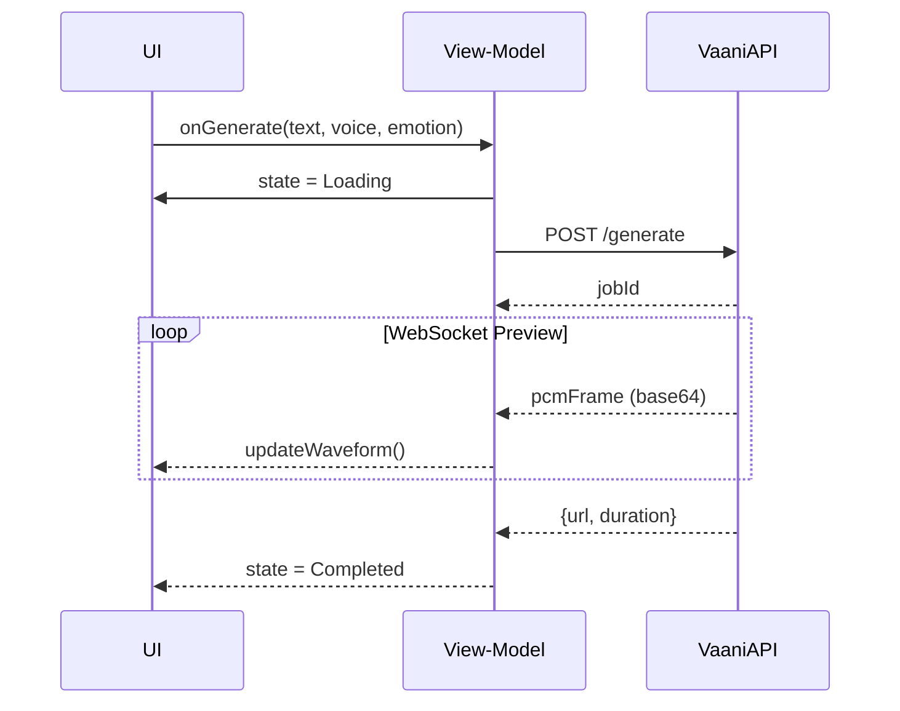

# Frontend ED

---

# Vaani – Front‑end Architecture & Engineering Spec (v0.1)

**Platforms:** Flutter (📱Android/iOS) • Next.js (🌐Web)

**Audience:** Front‑end engineers, UX/UI, QA, DevOps

**Revision Date:** 19 May 2025

---

## 1 Objectives

- Ship a **unified UX** across mobile & web with >90 % shared business logic.
- Maintain **Time‑to‑Interactive < 1.2 s** on web (3G Fast‑3 profile) & initial APK ≤ 25 MB.
- Achieve **Core Web Vitals green** (LCP < 2.5 s, CLS < 0.1).
- Fully localisable (English + Hindi day‑1) & accessible (WCAG 2.1 AA).

---

## 2 High‑Level Structure

```
packages/
  common_ui/         # design‑system widgets & Tailwind tokens
  analytics/         # PostHog / Sentry wrappers
  vaani_api/         # gRPC & REST clients (generated)
  audio_player/      # low‑latency streaming wrapper (just_audio)
apps/
  mobile/            # Flutter (android/ios)
  web/               # Next.js 14 (app‑router)

```

### 2.1 Technology Stack

| Concern | Mobile (Flutter 3.22) | Web (Next.js 14) |
| --- | --- | --- |
| UI | **Material 3** w/ Tailwind‑like tokens | **Shadcn/ui** + TailwindCSS |
| State | **Riverpod 3** (hooks) | **TanStack Query** + Zustand |
| Networking | gRPC via `grpc-dart` + `grpc-web` polyfill | gRPC‑web via `@connectrpc/connect-query` |
| Auth | Firebase Auth (phone) | Firebase Web SDK |
| Local cache | Hive (encrypted box) | IndexedDB via `idb-keyval` |
| Streaming audio | `just_audio` w/ `AudioSource.uri(WebSocket)` | Web Audio API (`AudioWorklet`) |
| Build/CI | Melos monorepo, GitHub Actions | Turborepo pipeline |

---

## 3 Key Screens & Components

| Route | Flutter Widget / React Page | Components |
| --- | --- | --- |
| `/` | **OnboardingScreen / onboarding/page.tsx** | Phone OTP, language picker |
| `/projects` | **ProjectListScreen** | ProjectCard, FAB (+ new) |
| `/editor/:id` | **ScriptEditorScreen** | TextField (Rich), EmotionSlider, CostMeter |
| `/preview/:id` | **PreviewModal** | WaveformView, PlayPauseBtn, RegenBtn |
| `/mixer/:id` | **TimelineScreen** | TrackLane, DragHandle, BGMusicPicker |
| `/export/:id` | **ExportSheet** | FormatSelect, ShareSheet |
| `/settings` | **SettingsScreen** | ClonedVoicesList, ThemeToggle, LangToggle |

### 3.1 Reusable Widgets (common_ui)

- `VButton`, `VIconButton`, `VSlider`, `VoiceAvatar`, `WaveformBar`, `LoadingShimmer`.
- Theming via `ThemeData` tokens that map 1‑to‑1 with Tailwind (`text-neutral-800`, `primary-600`).
- Auto‑adapt size using `MediaQuery` & `LayoutBuilder` breakpoints.

---

## 4 Data Flow



- **Optimistic UI** – show preview immediately using first frames.
- **TanStack Query/Riverpod** manages cache/invalidations with stale‑while‑revalidate.

---

## 5 State Management

### 5.1 Riverpod (Dart)

```dart
final projectProvider = NotifierProvider<ProjectNotifier, AsyncValue<Project>>;
final authProvider    = StreamProvider<User?>((ref) => FirebaseAuth.instance.authStateChanges());
final websocketProvider = Provider<WebSocketService>((_) => ...);

```

- Use `AsyncValue.guard()` for error handling, surface SnackBars.

### 5.2 Zustand (React)

```
interface EditorState {
  text: string;
  voiceId: string;
  emotion: number;
  setText(t: string): void;
}
export const useEditor = create<EditorState>((set)=>({...}));

```

- Persist across refresh via Zustand `persist` plugin (IndexedDB).

---

## 6 Networking Layer

- **Code‑gen:** `buf` generates protobuf TS + Dart stubs from shared `protos/vaani.proto`.
- **gRPC‑web via Connect RPC** – transports: Fetch (http2‑over‑http1.1) with binary stream.
- Back‑off retry: exponential capped @ 4 tries (500 ms → 8 s).
- Timeout: 30 s generate, 10 s preview connect.

---

## 7 Performance Budgets

| Target | Mobile | Web |
| --- | --- | --- |
| App size | ≤ 25 MB APK | JS ≤ 250 KB gzipped |
| First paint | < 800 ms (hot start) | TTI < 1.2 s (Fast‑3) |
| Frame jank | < 1 % over 16 ms | CLS < 0.1 |
- Use `flutter build --split-debug-info` & deferred components for rare screens.
- Next.js – enable `appRouter`, `static` routes, image optimisation, `next/font` for fonts.

---

## 8 Accessibility & i18n

- `semanticsLabel` on every interactive widget; test via `flutter_a11y` plugin.
- React uses `aria-*` attributes, keyboard nav.
- Strings in `lib/l10n/intl_en.arb`, `intl_hi.arb`; web uses `next-intl`.
- Numerals localised (`intl/NumberFormat.compact()`).

---

## 9 Analytics & Error Reporting

- **PostHog** event tracking via shared `analytics/` pkg. Events: `generate_clicked`, `preview_latency`, `clone_success`.
- **Sentry** for Dart & JS – DSN project `vaani-prod`.
- Privacy: send no raw text/audio; only lens‑scrubbed metadata (chars, lang, duration).

---

## 10 Testing Strategy

| Layer | Framework | Coverage Target |
| --- | --- | --- |
| Unit | `flutter_test` / Jest | 80 % functions |
| Widget / Component | `golden_toolkit` / React Testing Library | Top 10 widgets |
| Integration | `integration_test` + Firebase emulators | Generate flow, clone flow |
| E2E (CI) | Cypress (PWA) / `flutter_driver` (mobile) | Smoke cred, P90 latency assertion |

CI matrix (GitHub Actions): Android (api‑33), iOS (15.0), Chrome, Safari.

---

## 11 Build & Release

| Pipeline | Step |
| --- | --- |
| **Flutter** | `melos bootstrap` → `flutter test` → `flutter build apk/ipa` → upload to Firebase App Distribution |
| **Web** | `pnpm i` → `pnpm test` → `next build && next export` → push to Cloudfront S3 site |
| Versioning | `v0.x.y` tag triggers web deploy + TestFlight push |

---

## 12 Security & Privacy (Front‑end)

- Enforce TLS pinning (mobile) via `dio_pin`.
- Store JWT & refresh tokens in **secure storage** (Keychain/Keystore).
- Clipboard autoclear after 30 s for any copied user audio URLs.

---

## 13 Open‑Source Package Policy

- MIT/Apache‑2 only; no GPL.
- Review via `oss‑licenses‐scanner` job; block pipeline on violation.

---

## 14 Future Enhancements

1. **PWA install** capability (Browser + Service Worker offline read‑aloud).
2. **Desktop** – Flutter Desktop wrapper (Windows/macOS) reusing 90 % code.
3. **Live-collab** – Yjs CRDT doc for multiple editors.
4. **Voice Marketplace UI** – in‑app purchase carousel (v1.2).

---

**End of Front‑end Engineering Spec v0.1**